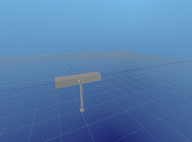
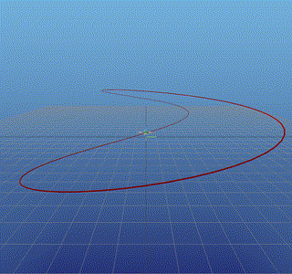
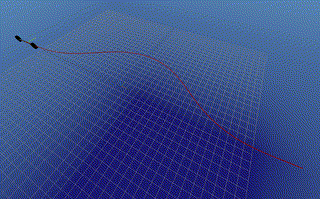
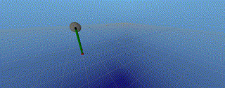

# 16745-Optimal-Control-and-RL

| **.Labs** | **Description**                          | **=================================== Parts of the Video Demonstrations in Each Lab ===================================** |
| --------- | ---------------------------------------- | ---------------------------------------- |
| Lab 0     | Intro to Julia.                          |                                          |
| Lab 1     | Q1 Integration   Q2 about kkt and newton method (LagrangeQP obj and constraint).   Q3 about solve qp & Aug Lagrangian |  <!--video width="100%" height="240" controls><source src="./HW1_S24-main/falling_brick.mp4" type="video/mp4">Your browser does not support the video tag.</video--> |
| Lab 2     | Q1 LQR Convex Opt & Reccati.   Q2 LQR for nonlinear; linearization   Q3 mpc convex opt; rendezvous & docking. |  <!--video width="100%" height="240" controls><source src="./HW2_S24-main/ihlqr_cartpole.mp4" type="video/mp4">Your browser does not support the video tag.</video-->    <!--video width="100%" height="240" controls><source src="./HW2_S24-main/optimal_rendezvous_docking_mpc_convex.mp4" type="video/mp4">Your browser does not support the video tag.</video--> |
| Lab 3     | Q1 ipopt to solve nlp; DIRCOL   Q2 iLQR on quadrotors trajectory following   Q3 nlp ipopt with quadrotors with safety distance constraints. |  <!--video width="100%" height="240" controls><source src="./HW3_S24-main/swingup_ipopt.mp4" type="video/mp4">Your browser does not support the video tag.</video-->    <!--video width="100%" height="240" controls><source src="./HW3_S24-main/quadrotor_ilqr.mp4" type="video/mp4">Your browser does not support the video tag.</video-->    <!--video width="100%" height="240" controls><source src="./HW3_S24-main/quadrotor_reorient_ipopt.mp4" type="video/mp4">Your browser does not support the video tag.</video--> |
| Lab 4     | Q1 ILC, bicycle model.   Q2 hybrid trajectory optimization biped walker with ipopt.   The hybrid systems, switch between different modes of operation, each governed by its own set of dynamics. |  <!--video width="100%" height="240" controls><source src="./HW4_S24-main/nonlinear_bicycle_model_iterative_learning_control.mp4" type="video/mp4">Your browser does not support the video tag.</video-->    <!--video width="100%" height="240" controls><source src="./HW4_S24-main/hybrid_biped_walker_ipopt.mp4" type="video/mp4">Your browser does not support the video tag.</video--> |

